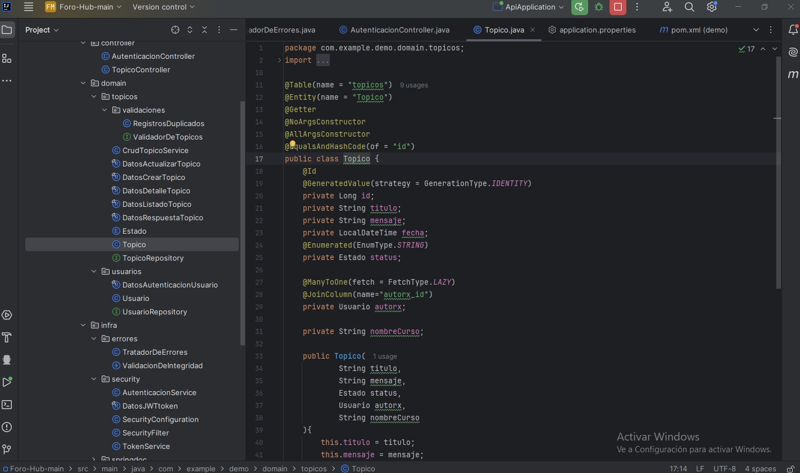
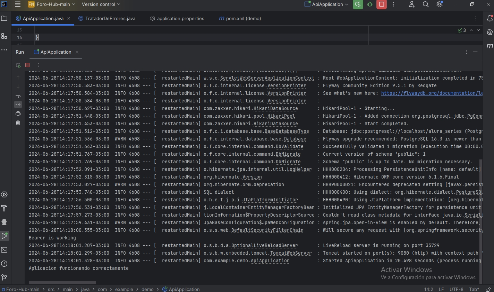
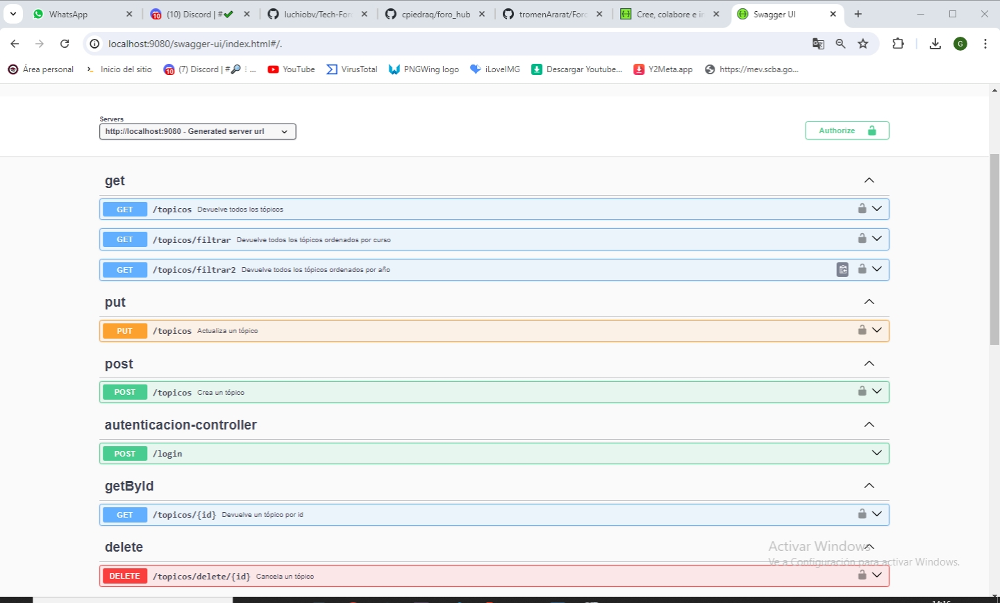

## Desafío Foro-Hub Alura Latam

<a href="https://www.aluracursos.com/">Alura latam</a>

<h3>Descripción del proyecto</h3>

Este desafio se centra en una API Rest utilizando JAVA SpringBoot para el #Challanger de la Formación en Desarrollo Backend de #Alura y #Oracle

<h5>## Funcionalidades del proyecto</h5>

La API se centrará específicamente en los tópicos, y permitir a los usuarios 

- Creacion de Tópicos
- Visualizacion de los Tópicos creados
- Busqueda de Tópicos
- Actualizacion de Tópicos
-Eliminacion de Tópicos

## 🛠️ Tecnologias utilizadas en este proyecto

- Java JDK: versión: 21 
- Maven
- Spring Boot
- MySql
- Documentación con Swagger

`Dependencias de JAVA`

- Lombok
- Spring Web
- Spring Boot DevTools
- Spring Data JPA
- Flyway Migration
- MySQL Driver
- Validation
- Spring Security

